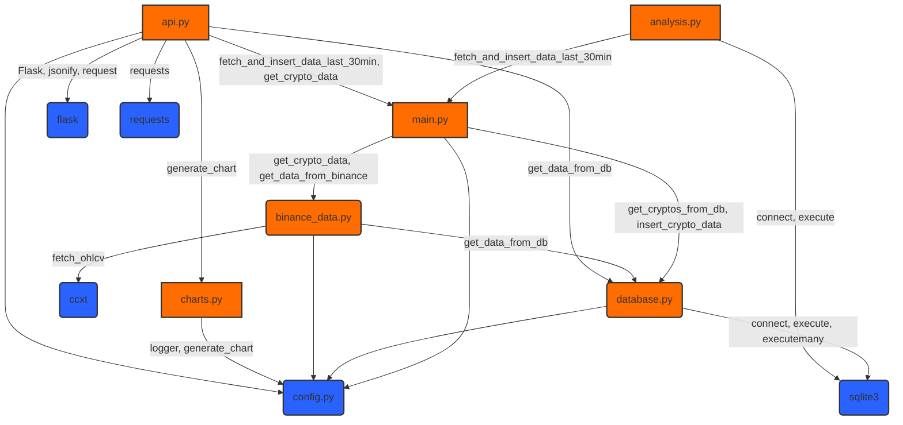

# Diagrama de los ficheros .py



```mermaid
sequenceDiagram
    participant main_script as "main (script if __name__ == '__main__')"
    participant ar_module as "analisis_rendimineto.py"
    participant db_module as "database.py"
    participant mod_clase as "modelos.CriptoEnCartera"
    participant bd_module as "binance_data.py"
    participant ccxt_lib as "ccxt.Binance (Librería Externa)"

    main_script->>ar_module: calcular_rendimiento_portafolio_total()
    activate ar_module
    ar_module->>db_module: obtener_portafolio()
    activate db_module
    db_module-->>ar_module: simbolos_portafolio
    deactivate db_module

    loop Para cada simbolo_criptomoneda en simbolos_portafolio
        ar_module->>ar_module: calcular_rendimiento_criptomoneda(simbolo_criptomoneda)
        note right of ar_module: Inicio del cálculo para un símbolo específico
        activate ar_module ## Llamada interna/recursiva

        ar_module->>db_module: obtener_operaciones_por_criptomoneda(simbolo_criptomoneda)
        activate db_module
        db_module-->>ar_module: lista_operaciones
        deactivate db_module
        
        note right of ar_module: Itera sobre 'lista_operaciones' para calcular: <br/> cantidad_actual_cripto, <br/> costo_total_compras_historicas, <br/> cantidad_total_comprada_historicamente

        ar_module->>mod_clase: CriptoEnCartera(simbolo_criptomoneda)
        activate mod_clase
        note left of mod_clase: Se crea la instancia. <br/> Las cachés internas (_precio_actual_cache, etc.) <br/> están inicialmente vacías (None).
        mod_clase-->>ar_module: instancia_cripto_para_precio
        deactivate mod_clase

        ar_module->>mod_clase: instancia_cripto_para_precio.precio_actual (acceso a la propiedad)
        activate mod_clase
        alt _precio_actual_cache is None (La caché está vacía)
            mod_clase->>bd_module: get_crypto_data(simbolo_criptomoneda, timeframe='1m', limit=1)
            activate bd_module
            bd_module->>bd_module: get_data_from_binance(simbolo_criptomoneda, timeframe='1m', limit=1)
            activate bd_module ## Llamada interna
            bd_module->>ccxt_lib: fetch_ohlcv(simbolo_EUR, '1m', limit=1)
            activate ccxt_lib
            ccxt_lib-->>bd_module: datos_ohlcv_binance
            deactivate ccxt_lib
            bd_module-->>bd_module: datos_historicos_formateados
            deactivate bd_module ## Fin llamada interna
            
            bd_module->>bd_module: get_moving_average_from_db(simbolo_criptomoneda, window=12)
            activate bd_module ## Llamada interna
            note right of bd_module: Consulta SQL a la tabla 'crypto_data'
            bd_module-->>bd_module: media_movil_db
            deactivate bd_module ## Fin llamada interna
            
            bd_module-->>mod_clase: precio_actual_obtenido, _, _, media_movil_db
            deactivate bd_module
            note left of mod_clase: Se actualiza _precio_actual_cache con el valor obtenido.
            mod_clase-->>ar_module: precio_mercado_actual (valor obtenido de API/DB)
        else _precio_actual_cache is NOT None (El precio ya está en caché)
            mod_clase-->>ar_module: precio_mercado_actual (valor desde caché)
        end
        deactivate mod_clase
        
        note right of ar_module: Cálculos finales de rendimiento: <br/> valor_mercado_actual, <br/> beneficio_perdida_abs, <br/> beneficio_perdida_pct

        ar_module-->>ar_module: datos_rendimiento_cripto (diccionario resultado)
        deactivate ar_module ## Fin llamada interna/recursiva
    end
    ar_module-->>main_script: lista_resultados_completos
    deactivate ar_module

```